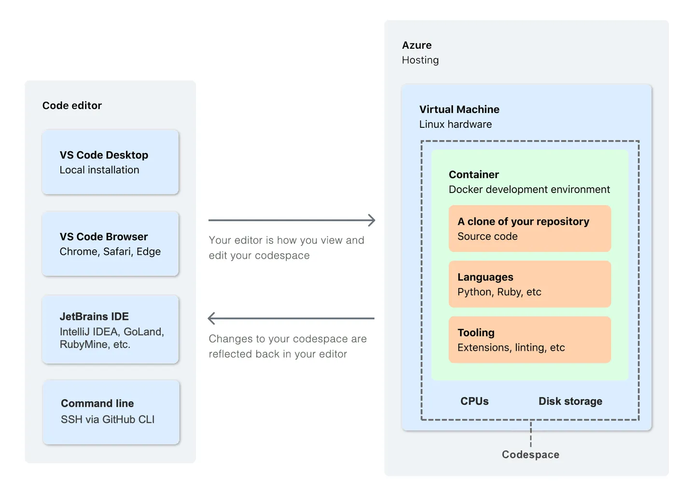

## GitHub Codespaces 使用技巧

修订：2023.9.7 09:00

### 帮助文档

GitHub Codespaces 入门文档 \
https://docs.github.com/zh/codespaces/overview \
什么是代码空间？ \
代码空间是托管在云中的开发环境。 可通过将配置文件提交到存储库（通常称为“配置即代码”）来为 GitHub Codespaces 自定义项目，这将为项目的所有用户创建可重复的 codespace 配置。

创建的每个 codespace 都由 GitHub 托管在虚拟机上运行的 Docker 容器中。 可以从多种虚拟机类型中选择，从 2 核、8 GB RAM 和 32 GB 存储，到最多 32 核、64 GB RAM 和 128 GB 存储。

默认情况下，codespace 基于 Ubuntu Linux 映像创建的，该映像包含各种流行语言和工具，但你可以使用基于所选 Linux 发行版的映像，并根据你的特定要求对其进行配置。 无论本地操作系统是什么，codespace 都将在 Linux 环境中运行。 远程容器不支持 Windows 和 MacOS 操作系统。

可以从浏览器、Visual Studio Code、JetBrains Gateway 应用程序或使用 GitHub CLI 连接到 codespaces。 连接时，你将位于 Docker 容器中。 你无权访问外部 Linux 虚拟主机。

https://code.visualstudio.com/docs/remote/codespaces \

### 小技巧

